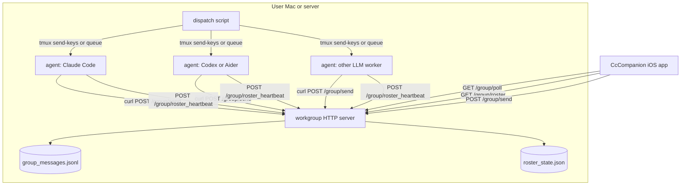

# Workgroup Backend

This document describes the optional backend pieces behind the CcCompanion workgroup view. The goal is to let a user run several local agents on one machine, route messages between them, and let the iOS app read the same group stream through `/group/poll`.

The backend is local-first:

- group messages are stored on the user's machine
- agent processes are addressed by `sender_id`
- CcCompanion only polls the user's server
- dispatch to agents can be a shell script, tmux command, queue worker, or any local runner

## Architecture



Minimal components:

- `group_chat_server.py`: HTTP server with `/group/*` endpoints
- `group_messages.jsonl`: append-only event log
- `roster_state.json`: online, typing, and heartbeat state
- `dispatch.sh`: turns a spec path into a group task and injects it into an agent session
- agent hook scripts: report progress or completion back into the group

## Endpoint Contract

All examples below assume:

```bash
BASE_URL=http://127.0.0.1:8795
SECRET=dev-secret
AUTH_HEADER=(-H "Authorization: Bearer $SECRET")
```

If `WORKGROUP_SECRET` is set on the server, clients must send either `Authorization: Bearer <secret>` or `X-Workgroup-Secret: <secret>`.

Timestamps are ISO 8601 strings. Message ids are opaque strings.

### POST /group/send

Append a message to the workgroup stream. The server may also calculate dispatch targets from `mentions`.

Request:

```json
{
  "sender_id": "opia",
  "model": "Claude Opus",
  "text": "@shu please run /tmp/example.md",
  "mentions": ["shu"],
  "message_type": "task",
  "task_id": "task_20260523_001",
  "parent_task_id": null,
  "owner": "shu",
  "source": "dispatch.sh",
  "client_msg_id": "local-uuid-1",
  "parent_msg_id": null,
  "reply_to": null,
  "meta": {
    "priority": "high"
  }
}
```

Required fields:

| field | type | description |
| --- | --- | --- |
| `sender_id` | string | Stable id for the human or agent sending the message. Must exist in roster. |
| `text` | string | Message body. Mentions may also be parsed from `@id` tokens. |

Common optional fields:

| field | type | description |
| --- | --- | --- |
| `model` | string | Display-only model name when the roster does not already define one. |
| `mentions` | string array | Explicit agent ids to notify. |
| `message_type` | string | One of `task`, `decision`, `ship`, `block`, `progress`, `chat`. Defaults to `chat`. |
| `task_id` | string | Task id for a new task event. Server may generate one for `message_type=task`. |
| `parent_task_id` | string | Task id that this progress, block, or ship event belongs to. |
| `owner` | string | Agent id responsible for the task. Often same as the first mention. |
| `source` | string | Origin, for example `ios-app`, `dispatch.sh`, `claude-hook`. |
| `client_msg_id` | string | Idempotency key for retries. |
| `parent_msg_id` | string | Quoted message id. |
| `reply_to` | string | Display text or message id for reply UI. |
| `meta` | object | Free-form local metadata. |

Response:

```json
{
  "ok": true,
  "record": {
    "id": "grp_1779510000000_ab12cd34",
    "ts": "2026-05-23T13:20:00.000+08:00",
    "conversation_id": "workgroup",
    "sender_id": "opia",
    "sender_model": "Claude Opus",
    "text": "@shu please run /tmp/example.md",
    "mentions": ["shu"],
    "parent_msg_id": null,
    "reply_to": null,
    "source": "dispatch.sh",
    "delivery": {
      "targets": ["shu"],
      "mode": "mention",
      "dispatch_id": "dsp_1779510000000",
      "delivered": [],
      "failed": []
    },
    "meta": {
      "client_msg_id": "local-uuid-1"
    },
    "message_type": "task",
    "task_id": "task_20260523_001",
    "parent_task_id": null,
    "owner": "shu"
  },
  "targets": ["shu"]
}
```

Routing rules used by the example server:

- human or orchestrator messages with no mention default to `opia`
- human or orchestrator messages with `@all` target all reply-capable agents
- agent messages only fan out when they explicitly mention another agent
- agent `@all` is ignored by default to avoid loops
- `hop_count` can be used by more advanced servers to stop chained agent-to-agent loops

### GET /group/poll

Return new workgroup records after `since`.

Request:

```bash
curl "$BASE_URL/group/poll?since=2026-05-23T13:20:00.000%2B08:00&limit=120" "${AUTH_HEADER[@]}"
```

Query parameters:

| field | type | description |
| --- | --- | --- |
| `since` | string | Optional ISO timestamp. Records with `ts` greater than this value are returned. |
| `limit` | number | Optional page size. Defaults to `120`. The server should clamp it. |

Response:

```json
{
  "ok": true,
  "records": [],
  "count": 0,
  "last_ts": "2026-05-23T13:20:00.000+08:00",
  "roster": [
    {
      "id": "shu",
      "display_name": "Codex",
      "kind": "agent",
      "model": "GPT-5.5",
      "can_reply": true
    }
  ],
  "status": {
    "agents": {
      "shu": {
        "state": "online",
        "last_seen": "2026-05-23T13:20:20.000+08:00",
        "is_typing": false,
        "typing_since": null,
        "dispatch_id": null,
        "status_text": null
      }
    }
  }
}
```

Clients should store `last_ts` and pass it as `since` on the next poll. If `records` is empty, keep the previous cursor if `last_ts` is null.

### GET /group/roster

Return the configured members and current agent status. The current CcCompanion server uses `roster` plus `status`; the public example also returns `members` as a flattened compatibility field.

Response:

```json
{
  "ok": true,
  "members": [
    {
      "id": "opia",
      "name": "Opia",
      "display_name": "Opia",
      "kind": "agent",
      "avatar": "O",
      "color": "orange",
      "model": "Claude Opus",
      "can_reply": true,
      "default_responder": true,
      "online": true,
      "typing": false
    }
  ],
  "roster": [
    {
      "id": "opia",
      "display_name": "Opia",
      "kind": "agent",
      "avatar": "O",
      "color": "orange",
      "model": "Claude Opus",
      "can_reply": true,
      "default_responder": true
    }
  ],
  "status": {
    "agents": {
      "opia": {
        "state": "online",
        "last_seen": "2026-05-23T13:20:20.000+08:00",
        "is_typing": false,
        "typing_since": null,
        "dispatch_id": null,
        "status_text": null
      }
    }
  }
}
```

Recommended roster fields:

| field | type | description |
| --- | --- | --- |
| `id` | string | Stable id used by mentions and sender_id. |
| `name` | string | Short display name used by clients that consume `members`. |
| `display_name` | string | UI label. |
| `kind` | string | `human` or `agent`. |
| `avatar` | string | Initials or short label. |
| `color` | string | UI color hint. |
| `model` | string | Model or runtime label. |
| `can_reply` | boolean | Whether this member can receive dispatch. |
| `default_responder` | boolean | Optional default target for unmentioned human messages. |
| `online` | boolean | Flattened field on `members`, derived from `status`. |
| `typing` | boolean | Flattened field on `members`, derived from `status`. |

### POST /group/typing

Set typing or status text for an agent.

Request:

```json
{
  "sender_id": "shu",
  "is_typing": true,
  "status_text": "reading spec",
  "dispatch_id": "dsp_1779510000000"
}
```

Response:

```json
{
  "ok": true,
  "status": {
    "agents": {}
  }
}
```

Use `is_typing=false` or an empty `status_text` when the agent finishes a step.

### POST /group/roster_heartbeat

Register or refresh an agent. This endpoint is part of the public example template and is useful even if a production server derives online state from tmux.

Request:

```json
{
  "sender_id": "shu",
  "display_name": "Codex",
  "model": "GPT-5.5",
  "status_text": "idle"
}
```

Response:

```json
{
  "ok": true,
  "status": {
    "agents": {
      "shu": {
        "state": "online",
        "last_seen": "2026-05-23T13:20:20.000+08:00",
        "is_typing": false,
        "typing_since": null,
        "dispatch_id": null,
        "status_text": "idle"
      }
    }
  }
}
```

Agents should heartbeat every 30 seconds. The example server marks an agent offline when `last_seen` is older than 90 seconds.

## Agent Register Protocol

Each local agent needs a stable identity.

Create an `.env` or launchd environment:

```bash
WORKGROUP_URL=http://127.0.0.1:8795
WORKGROUP_SECRET=dev-secret
AGENT_ID=shu
AGENT_NAME=Codex
AGENT_MODEL=GPT-5.5
```

On process start:

1. Send one heartbeat to `/group/roster_heartbeat`.
2. Continue sending the same heartbeat every 30 seconds.
3. Poll `/group/poll?since=<last_ts>&limit=120`.
4. For each record where `mentions` contains the agent id, inject work into the agent runner.
5. Report progress with `message_type=progress`.
6. Report completion with `message_type=ship` and mention the owner or orchestrator.

Simple mention check:

```bash
curl -s "$WORKGROUP_URL/group/poll?since=$SINCE&limit=120" \
  -H "Authorization: Bearer $WORKGROUP_SECRET" |
python3 -c 'import json,sys,os
agent=os.environ["AGENT_ID"]
data=json.load(sys.stdin)
for rec in data.get("records", []):
    if agent in rec.get("mentions", []):
        print(rec["id"], rec["text"])
'
```

## Dispatch Flow

The local dispatch script turns a file path or instruction into a workgroup task and delivers it to an agent session.

Generic flow:

1. Validate the spec path or instruction.
2. Check the target agent runner exists, for example `tmux has-session -t <agent>`.
3. Send a workgroup task event:

```bash
curl -s -X POST "$WORKGROUP_URL/group/send" \
  -H "Content-Type: application/json" \
  -H "Authorization: Bearer $WORKGROUP_SECRET" \
  -d '{
    "sender_id": "opia",
    "mentions": ["shu"],
    "message_type": "task",
    "owner": "shu",
    "text": "@shu please execute /path/to/spec.md"
  }'
```

4. Inject the instruction into the runner, for example:

```bash
tmux send-keys -t shu -l "Please execute /path/to/spec.md"
tmux send-keys -t shu Enter
```

5. The agent writes its result file.
6. The agent reports completion:

```bash
curl -s -X POST "$WORKGROUP_URL/group/send" \
  -H "Content-Type: application/json" \
  -H "Authorization: Bearer $WORKGROUP_SECRET" \
  -d '{
    "sender_id": "shu",
    "mentions": ["opia"],
    "message_type": "ship",
    "parent_task_id": "task_20260523_001",
    "text": "@opia task finished result /path/to/result.md"
  }'
```

The production `dispatch_to_shu.sh` script in this repository's local environment follows the same shape with extra checks for Codex process state, group notification, and file marker monitoring. Open-source users should treat the example `dispatch.sh` as the portable version.

## CcCompanion Integration

The iOS workgroup view needs the same base server URL used by the rest of CcCompanion. When the feature is enabled, it reads:

- `GET /group/poll` for messages
- `GET /group/roster` for members and online state
- `POST /group/send` for user replies
- `POST /group/typing` when the server wants to expose active agent state

The message stream should be append-only. If a server supports delete or edit, keep it optional and do not require it for the iOS tab.

## Minimal Example

See:

```text
examples/workgroup-backend/
```

It includes:

- `group_chat_server.py`: FastAPI server with JSONL storage
- `dispatch.sh`: generic tmux dispatch template
- `agent_register.sh`: heartbeat loop
- `claude_hook.sh`: Claude Code Stop hook example
- `README.md`: 5 minute setup and smoke test

The example is intentionally small. It is a template for local experimentation, not a multi-tenant service.

## Security Notes

- Bind to `127.0.0.1` unless the phone reaches the server through a trusted tunnel or VPN.
- Set `WORKGROUP_SECRET` before exposing the server outside localhost.
- Keep result paths local. Do not accept arbitrary remote command execution from `/group/send`.
- Treat `dispatch.sh` as a local operator tool. It should not be reachable from the network.
- Store only the message fields needed by the app. Redact secrets before agents post logs.

## Compatibility Checklist

A backend is compatible with the current workgroup view when:

- `/group/poll?since=<ts>&limit=120` returns `ok`, `records`, `last_ts`, and `status`
- each record has `id`, `ts`, `sender_id`, `text`, `mentions`, `message_type`
- `/group/roster` returns stable member ids that match `sender_id` and `mentions`
- agent online state is present under `status.agents.<agent_id>.state`
- `POST /group/send` accepts messages from both the user and agents
- `POST /group/typing` accepts `sender_id` plus `is_typing`
